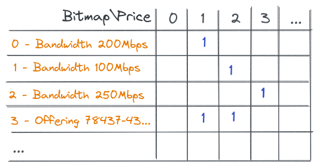

# Design & Research

## Into

Source system stores all prices. The task for this service - provide ability to find price.

This search depends on many conditions, like start date \ end date, offering, characteristics like Internet Bandwidth,
Contract Term, etc., some grouping criterias. This search is one of many other tasks we need to execute during typical
flow. All the tasks (including current one - find price) is synchronous from end-user perspective:
it waits for the results right away.

## Requirements

## Functional

* Find price by conditions
* Few prices could be found in case when not all conditions known
* There is always one price when all conditions satisfied

### Condition Operations

* `equals` (supported)
* `not equals`
* `between`
* `in`
* `not in`

### Condition Data Types

* `string` (list value) (supported)
* `integer`
* `date` (YYYY.MM.DD HH) (partially tested)
    * Minutes support is a question

### Non-Functional Requirements

* The amount of prices is `<2M`.
* The amount of conditions `<20`
* The amount of prices per offering: `<20k`
* Time limitation `<10ms` for each search
* Time limitation for `3k` searches `<100ms`
    * Preferable to get `<10ms`
* Memory limitation: `<1 GB` for all prices in memory
    * `<500 byte` per price
* Requests\s is not specified. `2000/s ?`
    * It should be possible to run more instances of this service

## Design

The typical implementation of such search is simple iteration over the prices - `O(2M)` worst case. To avoid such a
terrible time complexity can be used `HashMap` by one of conditions. The most promising condition for `HashMap`
is `Offering`. This might not be the best one for all cases, but best in common. It will be `O(20k)` worst case. It is
very simple approach and might be enough to satisfy initial requirements. However, what about cases when user needs to
calculate 3k searches in one request? Parallel calculation might help, but is it possible to drop timing <100ms (when
CPU is limited)?!
One option is to support keys with few conditions or dynamically 1 to n-conditions. Possible drawback is blowing the
memory. That is when I discovered bitmaps and this entire repository is about comparing bitmaps and regular maps.

## Bitmaps v1 - Test

How user requests may look like:
Find price for this offering and all those attribute\values:
```json
{
  "offering": "78437-43fa-41fd-a681-9e1ad3ae0dvi",
  "group": "group1",
  "bandwidth": "100Mbps",
  "currency": "USD",
  ...
}
```
Response may look like
```json
{
  "id": "9ead77df-24d1-43e3-b39e-fdc806b7fc98",
  "value": "100.00",
  "currency": "USD",
  ...
}
```

All prices have their own ids ( `externalIds` ), which are strings (can be UUIDs). To be able to use them in bitmaps, it
is required to create `internalId` with data type `uint32` or `uint64`, and
mapping `internalId -> externalId`, like array `[]string`.

Bitmap is created for each attribute-value combination and prices related to this combination are stored there.
The amount of bitmaps is amount of attribute-value combinations. (`av`). 
All bitmaps can be stored in simple array `[]*Bitmap` and array index is `bitmapIndexId`

Based on provided attribute-value search for bitmap. Structure like `map[string]map[string]uint32` can help to find `bitmapIndexId`.
When all bitmaps found - apply `AND` between them.
In case if result is one price - search for `externalId` and `Price` entity itself - return it.

### Structures (summary)

* `[]string` - store internalId -> externalId for each price
    * `1 -> db108b38-04fa-41fd-a681-9e1ad3ae0fce`
    * `2 -> 9ead77df-24d1-43e3-b39e-fdc806b7fc98`
    * `3 -> c54a1b6e-03a6-469a-81b0-03ac77ce5d0`
* `map[string]map[string]uint32` - store `attribute -> value -> bitmap index id` for each existing attribute-value combination
  * `Bandwidth -> 200Mbps -> 0`
  * `Bandwidth -> 100Mbps -> 1`
  * `Bandwidth -> 500Mbps -> 2`
* `[]*Bitmap` - store all bitmaps by bitmap index id
  * `0 -> Bitmap` - bitmap stores prices that has `Bandwidth 200Mbps`
  * `1 -> Bitmap` - bitmap stores prices that has `Bandwidth 100Mbps`
  * `2 -> Bitmap` - bitmap stores prices that has `Bandwidth 500Mbps`
* `Bitmap` itself to store prices related to attribute-value combination
* `map[string]*Price` to store Price by externalId

* `n` is amount of prices
* `av` is amount of attribute-value combinations
* `c` is amount of containers for Roaring Bitmaps

#### Time complexity
* `[]string` - O(1)
* `map[string]map[string]uint32` - O(1)x2
* `[]*Bitmap` - O(1)
* `Roaring Bitmap`
  * log(k) - to find containers, where `k` is the smallest amount of containers (for first `AND`)
  * TODO - `AND` operation
* `map[string]*Price` - O(1)

#### Memory complexity

* `[]string` - O(n)
* `map[string]map[string]uint32` - O(av)
* `[]*Bitmap` - O(av)
* `Roaring Bitmap`
  * O(c), where `c` is amount of containers
* `map[string]*Price` - O(n)


### Price Representation
Since response required for user and data for search is completely different - in-memory price representation could be different.

#### Map
In-memory Price representation for Map contains all the fields required for search even if they are not needed in result
```json
{
  "id": "9ead77df-24d1-43e3-b39e-fdc806b7fc98",
  "offering": "78437-43fa-41fd-a681-9e1ad3ae0dvi",
  "group": "group1",
  "bandwidth": "100Mbps",
  "currency": "USD",
  "value": "100.00"
}
```
#### Bitmap
In-memory Price contains only fields required for response. 
All other 'attribute-values' used for search are stored in bitmaps and supported structures, which can be more efficient (see [benchmarks](benchmark.md))
```json
{
  "id": "9ead77df-24d1-43e3-b39e-fdc806b7fc98",
  "value": "100.00",
  "currency": "USD"
}
```